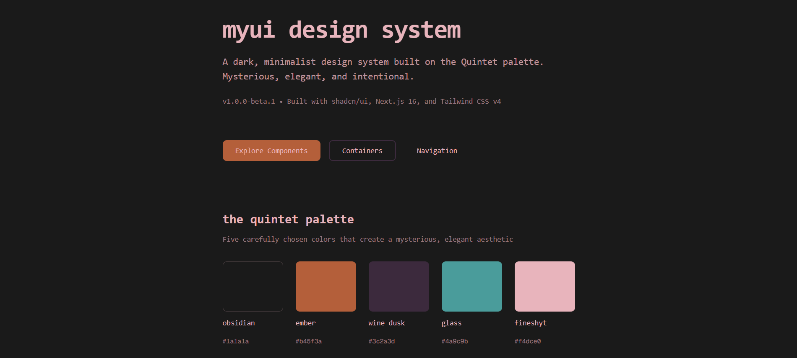

# MyUI Design System

> **v1.0.0-beta.1** - A dark, minimalist design system built on [shadcn/ui](https://ui.shadcn.com/) with the Quintet color palette.

[](https://nextjs.org/)
[](https://tailwindcss.com/)
[](https://www.typescriptlang.org/)
[](LICENSE)


## 🎨 The Quintet Palette

MyUI is built on five carefully chosen colors that create a mysterious, elegant aesthetic:

| Color | Hex | Usage |
|-------|-----|-------|
| **Obsidian** | `#1a1a1a` | Main backgrounds, the void |
| **Ember** | `#b45f3a` | Copper accents, active states, focus rings |
| **Wine Dusk** | `#3c2a3d` | Velvet containers, borders, depth |
| **Glass** | `#4a9c9b` | Aqua accents (legacy) |
| **FineShyt** | `#f4dce0` | Premium matte pink text |

## 🚀 Quick Start

```bash
# Clone the repository
git clone https://github.com/Niraj037/my-ui.git
cd my-ui

# Install dependencies
npm install

# Start development server
npm run dev

# Open http://localhost:3000
```

## 📦 Installation

MyUI is built on shadcn/ui. Components are copied into your project, giving you full control:

```bash
# Already included in this project
# Add individual components with:
npx shadcn@latest add [component-name]
```

## 📦 Quick Start Examples

### Basic Form
```tsx
import { Button, Input, Card, CardHeader, CardTitle, CardContent } from "@/components/ui"

export default function LoginForm() {
  return (
    <Card className="max-w-md mx-auto">
      <CardHeader>
        <CardTitle>sign in</CardTitle>
      </CardHeader>
      <CardContent className="space-y-4">
        <Input placeholder="Email" type="email" />
        <Input placeholder="Password" type="password" />
        <Button className="w-full">Sign In</Button>
      </CardContent>
    </Card>
  )
}
```

### Interactive Components
```tsx
import { Switch, Checkbox, Slider, Select } from "@/components/ui"

// Switch with state
const [enabled, setEnabled] = useState(false)
<Switch checked={enabled} onCheckedChange={setEnabled} />

// Checkbox
const [agreed, setAgreed] = useState(false)
<Checkbox checked={agreed} onCheckedChange={setAgreed} />

// Slider (single or range)
<Slider defaultValue={[50]} max={100} />
<Slider defaultValue={[25, 75]} max={100} /> {/* Range */}

// Select dropdown
<Select>
  <SelectTrigger><SelectValue placeholder="Choose..." /></SelectTrigger>
  <SelectContent>
    <SelectItem value="1">Option 1</SelectItem>
    <SelectItem value="2">Option 2</SelectItem>
  </SelectContent>
</Select>
```

### Dialogs & Modals
```tsx
import { Dialog, DialogTrigger, DialogContent } from "@/components/ui"

const [open, setOpen] = useState(false)

<Dialog open={open} onOpenChange={setOpen}>
  <DialogTrigger asChild>
    <Button>Open Dialog</Button>
  </DialogTrigger>
  <DialogContent>
    <DialogHeader>
      <DialogTitle>Confirm Action</DialogTitle>
    </DialogHeader>
    {/* Content */}
  </DialogContent>
</Dialog>
```

### Navigation
```tsx
import { Tabs, Breadcrumb, Pagination } from "@/components/ui"

// Tabs
<Tabs defaultValue="tab1">
  <TabsList>
    <TabsTrigger value="tab1">Tab 1</TabsTrigger>
    <TabsTrigger value="tab2">Tab 2</TabsTrigger>
  </TabsList>
  <TabsContent value="tab1">Content 1</TabsContent>
</Tabs>

// Breadcrumbs
<Breadcrumb>
  <BreadcrumbList>
    <BreadcrumbItem><BreadcrumbLink href="/">Home</BreadcrumbLink></BreadcrumbItem>
    <BreadcrumbSeparator />
    <BreadcrumbItem><BreadcrumbPage>Current</BreadcrumbPage></BreadcrumbItem>
  </BreadcrumbList>
</Breadcrumb>
```

### The Dock (macOS-style)
```tsx
import { Dock, DockIcon } from "@/components/ui/dock"
import { Home, Settings, User } from "lucide-react"

const [active, setActive] = useState("home")

<Dock direction="bottom"> {/* bottom, top, left, right */}
  <DockIcon 
    label="home" 
    isActive={active === "home"}
    onClick={() => setActive("home")}
  >
    <Home className="h-5 w-5" />
  </DockIcon>
  <DockIcon label="settings">
    <Settings className="h-5 w-5" />
  </DockIcon>
</Dock>
```

## 🎯 Component Library

### Core Elements
Interactive form components for user input and data collection.

| Component | Description |
|-----------|-------------|
| `Button` | Primary action triggers with variants (default, outline, secondary, ghost, destructive) |
| `Input` | Text fields with icon support, error states, and validation |
| `Textarea` | Multi-line text input |
| `Switch` | Toggle switches for binary settings |
| `Checkbox` | Multi-select options |
| `Radio` | Single-select groups |
| `Select` | Dropdown menus with search |
| `Slider` | Range inputs with single or dual handles |

### Structural Elements  
Containers and overlays for organizing content.

| Component | Description |
|-----------|-------------|
| `Card` | Content containers with variants (default, outlined, elevated) |
| `Dialog` | Modal overlays for critical interactions |
| `Drawer` | Bottom-sliding panels for mobile-friendly content |
| `Sheet` | Side-sliding panels for navigation and filters |
| `Tooltip` | Contextual hints on hover |
| `Popover` | Floating content panels |
| `Accordion` | Expandable content sections |

### Navigation
Components for moving through your application.

| Component | Description |
|-----------|-------------|
| `Navbar` | Persistent top navigation bar |
| `Breadcrumb` | Hierarchical navigation trail |
| `Tabs` | Content organization with smooth transitions |
| `Pagination` | Page navigation controls |
| `Command` | Keyboard-driven command palette |
| `Dock` | macOS-style floating navigation with magnification |

## 📖 Component Categories

### Core Elements (The Heartbeat)
`Button`, `Input`, `Textarea`, `Switch`, `Checkbox`, `Radio`, `Select`, `Slider`

### Structural Elements (Containers)  
`Card`, `Dialog`, `Drawer`, `Sheet`, `Tooltip`, `Popover`, `Accordion`

### Navigation (Movement)
`Navbar`, `Breadcrumb`, `Tabs`, `Pagination`, `Command`, `Dock`

## 🎨 Design Philosophy

**Visual Aesthetic**
- Dark, mysterious, and elegant
- Minimal with generous negative space
- Color separation instead of drop shadows
- Lowercase headings for artistic feel

**Animation Principles**
- 300-500ms transitions (ceremonial and intentional)
- Smooth spring physics for interactive elements
- No abrupt or jarring movements

**Typography**
- JetBrains Mono for monospace consistency
- FineShyt (#f4dce0) for readable text
- Lowercase headings throughout

**Color Usage**
- **Ember** for actions, active states, focus rings
- **Wine Dusk** for containers, borders, hover states
- **FineShyt** for text with varying opacity
- **Obsidian** for backgrounds

## 📖 Color Classes

```tsx
// Backgrounds
bg-obsidian bg-winedusk bg-ember

// Text
text-fineshyt text-ember

// Borders  
border-winedusk border-ember

// With opacity
bg-winedusk/50 text-fineshyt/80 border-ember/30
```

## 🛠️ Customization

All components accept `className` for Tailwind overrides:

```tsx
<Button className="w-full">Full Width</Button>
<Input className="max-w-xs" />
<Card className="border-ember">Custom Border</Card>
```

### Component Props

Components are built with TypeScript interfaces for type safety:

```tsx
// Button with loading state
<Button loading leftIcon={<Icon />}>
  Save Changes
</Button>

// Input with error handling
<Input 
  error 
  errorMessage="Invalid email"
  leftIcon={<Mail />}
/>

// Card with variants
<Card variant="outlined">
  {/* Content */}
</Card>
```


## 📖 Color Classes

```tsx
// Backgrounds
bg-obsidian bg-winedusk bg-ember

// Text
text-fineshyt text-ember

// Borders  
border-winedusk border-ember

// With opacity
bg-winedusk/50 text-fineshyt/80 border-ember/30
```

## 🛠️ Customization

All components accept `className` for overrides:

```tsx
<Button className="w-full">Full Width</Button>
<Input className="max-w-xs" />
<Card className="border-ember">Custom Border</Card>
```

## 📚 Tech Stack

- **[Next.js 16](https://nextjs.org/)** - React framework with App Router
- **[Tailwind CSS v4](https://tailwindcss.com/)** - Utility-first CSS with inline @theme
- **[shadcn/ui](https://ui.shadcn.com/)** - Component foundation
- **[Framer Motion](https://www.framer.com/motion/)** - Animation library for Dock
- **[Radix UI](https://www.radix-ui.com/)** - Accessible component primitives
- **[TypeScript](https://www.typescriptlang.org/)** - Type safety
- **[Lucide Icons](https://lucide.dev/)** - Icon library

## 📄 License

MIT License - See LICENSE file for details

## 🍷 Made by Niraj 
For WithinBrackets & other projects by Niraj

Copyright © 2024 - 2025

